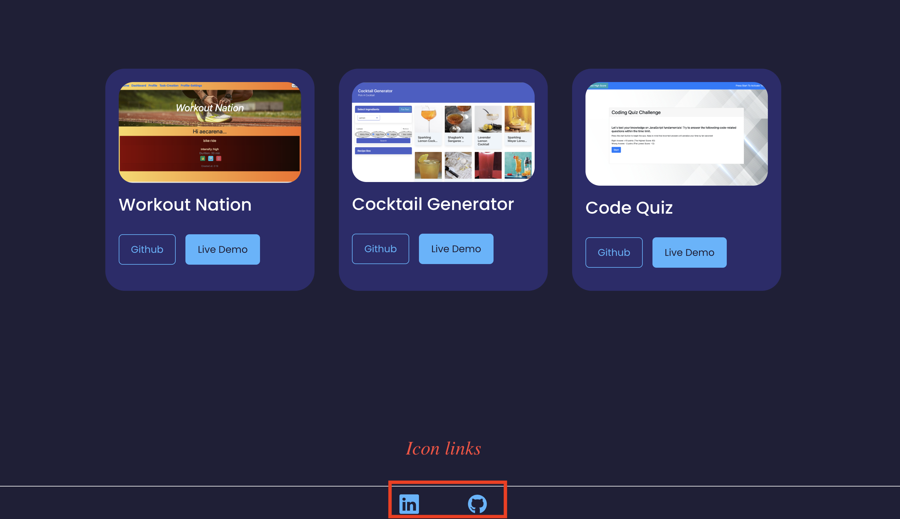

# Andrew's React Portfolio

## Table of contents

- [Overview](#overview)
  - [Screenshot](#screenshot)
  - [Links](#links)
- [My process](#my-process)
  - [Built with](#built-with)
  - [Setup](#setup)
- [Author](#author)

## Overview

### Screenshot

|  |
| :-------------------------------------: |
|           _↑ App Overview ↑_            |

|  |
| :-------------------------------------: |
|  _↑ Error Handling In Contact Form ↑_   |

|  |
| :-------------------------------------: |
|            _↑ Icon Links ↑_             |

### Links

- GitHub URL: [GitHub Repo](https://github.com/Andrew-TechMaster/AndrewChou-Portfolio-React)
- Live Site URL: [https://andrew-techmaster.github.io/AndrewChou-Portfolio-React/](https://andrew-techmaster.github.io/AndrewChou-Portfolio-React/)

## My process

### Built with

- React
- Bootstrap
- React-Icons

### Setup

> - To install dependencies, run "npm i" and then start the application with "npm run start"
>
> - To deploy on GitHub Page, use "npm run deploy"

## Author

Andrew (Sheng-Chu), Chou

- Website - [Andrew Chou](https://andrew-techmaster.github.io/AndrewChou-Portfolio-React/)
- GitHub - [Andrew-TechMaster](https://github.com/Andrew-TechMaster)

© 2023 edX Boot Camps LLC. Confidential and Proprietary. All Rights Reserved.
